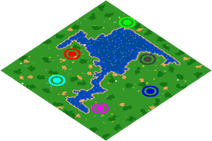
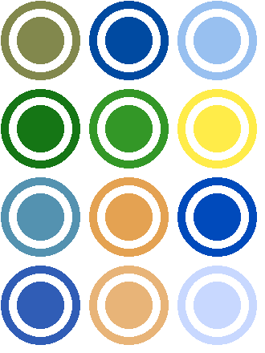
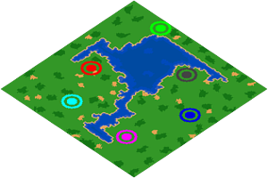
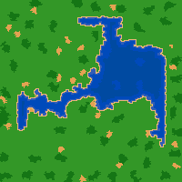
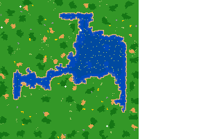
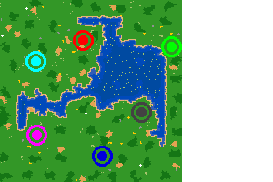

# AoE2 Minimap Generator
[](https://www.python.org/)
[](https://pypi.org/project/Pillow/)
[](https://pypi.org/project/mgz/)

[](https://github.com/Marfullsen/AoE2-minimap-generator)

## Description
Minimap generator for Age of Empires 2 savegames.

## Features
Vesion 1.0, working perfectly.

- Generate minimap from a saved game (.mgl, .mgx, .mgz and .aoe2record files).

- Rotate the map and add transparency to the background.

- Display the location of each player.

- Display the piles of gold and stone resources.

- Display the food resorces (berry bushes, animals like sheeps, fishes, boars, etc.)

- Display Relics on the minimap

## Dependencies
- [mgz](https://github.com/happyleavesaoc/aoc-mgz) (Also via pip: `pip install mgz`)
- [Pillow](https://pillow.readthedocs.io/en/stable/installation.html). (also via pip: `pip install Pillow`)

## Usage
Place the saved games in the same path as the Python script files, **after having installed the necessary dependencies**, run the Python script **"minimap_generator.py"**, voilà, minimap images will be generated, displayed and saved in the same directory.

## Installing Dependencies
Try these commands until you find one that works for you (this is because each linux distro is very picky), one of them should be suitable for you. [source: this question on Stack Overflow](https://stackoverflow.com/questions/20060096/installing-pil-with-pip)

**Linux**
```
sudo pip3 install pillow
sudo python3 -m pip install pillow

```

**Windows**
```
pip install Pillow
```

## Tiles colors available.
Extracted from [recage/examples/map/terrainColors.json](https://github.com/genie-js/recage/blob/master/examples/map/terrainColors.json).

[](https://github.com/Marfullsen/AoE2-minimap-generator/blob/master/colors_available.py)

## TODOs.
:heavy_check_mark: Add new TODOs.

:black_square_button: Fix bugs with some map sizes.

:black_square_button: Add walls when fortress (or whenever).

:black_square_button: Unify all code to a single 'main.py' file.

:black_square_button: Create a .exe file to non-python users.

:black_square_button: Add more tests, with more maps & more sizes.

:black_square_button: Tidy up all the mess with the files and screenshots.

## Development Screenshots

**Final without resources**

[]()


**Square without resources**

[]()


**Square with resources**

[]()


**Square with resources and players**

[]()

## Contributing
All contributions are welcome!
Feel free to open a pull request.

## Credits
Thanks to [aoc-mgz](https://github.com/happyleavesaoc/aoc-mgz) by [@HappyLeavesAoC](https://github.com/happyleavesaoc/) for the extract functions.
