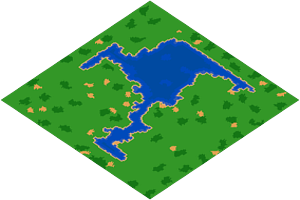
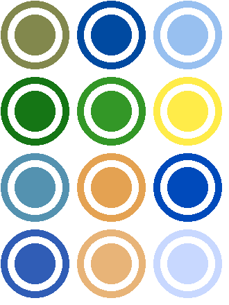

# AoE2 Minimap Generator
[](https://www.python.org/)
[](https://pypi.org/project/Pillow/)

[](https://github.com/Marfullsen/AoE2-minimap-generator)

## Desc
Minimap generator from Age Of Empires 2 game savegames.

## Features
- Vesion 0.1 only works with MGX files.

## Dependencies
- [mgz](https://github.com/happyleavesaoc/aoc-mgz) (Also via pip: `pip install mgz`)
- [Pillow](https://pillow.readthedocs.io/en/stable/installation.html). (also via pip: `pip install Pillow`)

## Usage
Place the saved games in the same path as the Python script file, **after having installed the necessary dependencies**, run the Python script, voilà, map images will be generated, displayed and saved in the same directory.

## Installing Dependencies
**Linux**
```
sudo pip3 install pillow
```
or
```
sudo python3 -m pip install pillow
```

**Windows**
```
pip install Pillow
```

## Tiles colors available.
Extracted from [recage/examples/map/terrainColors.json](https://github.com/genie-js/recage/blob/master/examples/map/terrainColors.json).

[](https://github.com/Marfullsen/AoE2-minimap-generator/blob/master/colors_available.py)

## TODO
:heavy_check_mark: Generate map from a saved game (.mgx).

:black_square_button: Add transparency.

:black_square_button: Put the gold and stone resources.

:black_square_button: Location of each player.

## Credits
Thanks to [aoc-mgz](https://github.com/happyleavesaoc/aoc-mgz) by [HappyLeavesAoC](https://github.com/happyleavesaoc/).